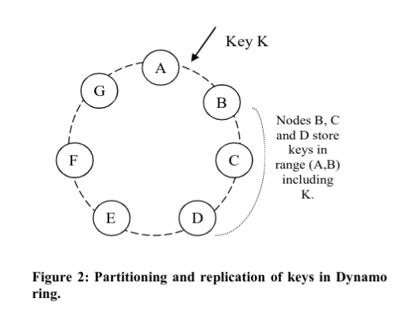

# Introducción

- Seccion 2 === Javi
- Fotito de Amazon
- Fotito de DynamoDB

## Motivación

## SLA y Problemas de negocio

## Key principles

## System assumptions and requirements

# Arquitectura de Sistema

- empezar con la seccion 3.3

::: notes

This is my note.

- It can contain Markdown
- like this list

:::

## Interfaz

## Particionado

## Replicado

- El coordinador replica a los N-1 siguientes nodos del anillo

- Todos los nodos conocen las responsabilidades del resto

- Los datos se distribuyen en nodos físicos, no virtuales

## Versionado de datos

- Consistencia _eventual_ -> Si opero *YA*, genero una inconsistencia entre nodos
  - Es como git: No quiero perder datos nunca. Cómo reconcilio las distintas versiones?
  - Cada versión es un Vector Clock -> `(nodo, contador)`

- Syntactic Reconciliation: Si una versión nueva supera la antigua, simplemente la reemplaza
- Semantic Reconciliation: Si no hay manera obvia de elegir la versión superadora, el
  cliente decide acorde a sus necesidades de negocio
    - Reglas de negocio -> _Shopping Cart_
    - "Last Write Wins" -> _Session Info_
    - High Performance Read Engine -> _Product Catalog_

## Handlear errores
