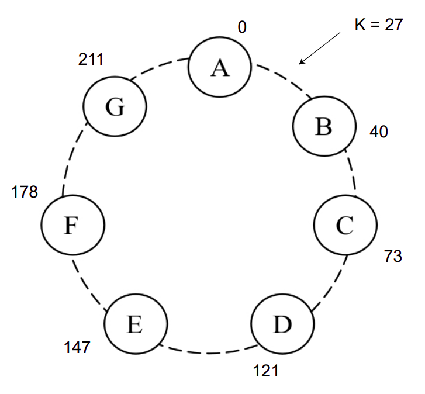
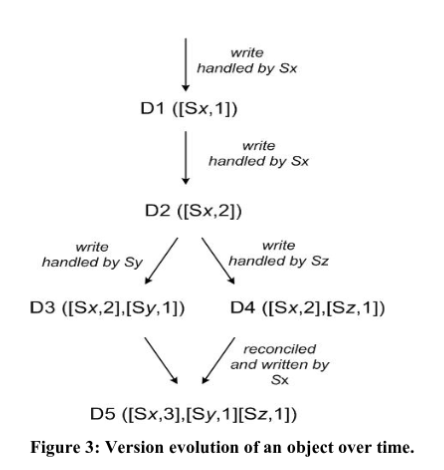

# Dynamo: Amazon's highly available key-value store

## Motivación
- Query model
	- Operaciones simples
	- Costos asociados a un RDBMS
- Propiedades `ACID`
	- Disponibilidad pobre
- Eficiencia
- Otras asunciones
	- No-hostil

::: notes
Muchos servicios dentro de Amazon tienen ciertos requisitos para los cuales una DB relacional esta lejos de ser ideal. Por complejidad, costo de mantenimiento, decisiones de diseño.

Utilizan items unívocamente identificados por una clave, haciendo operaciones simples de lectura y escritura. Las operaciones se hacen sobre elementos individuales y no hay necesidad de un esquema relacional.

La experiencia en Amazon demuestra que los almacenamientos de datos que proveen garantías ACID tienden a proveer una disponibilidad pobre. Dynamo se enfoca en aplicaciones que operan con consistencia mas débil si esto resulta en una disponibilidad mas alta. No provee ninguna garantía de aislamiento.

El sistema se diseño en base a la necesidad de ser ejecutado sobre hardware commodity, con requisitos de latencia medidos en el percentil 99.9 de la distribución. Los servicios deben poder configurar Dynamo de modo tal que puedan alcanzar sus requisitos de latencia y throughput.

El entorno se asume como no-hostil y no hay requisitos de seguridad.
:::

## SLA y Problemas de negocio
- 99.9th percentile
- Lógica liviana
	- Rol importante de los Data Stores

::: notes
En Amazon, los SLAs se expresan medidos sobre el percentil 99.9, basados en un análisis de costo beneficio.

La mayoría de los servicios de amazon tienen una lógica liviana, por tanto los sistemas de almacenamiento juegan un rol importante ene establecer su SLA. El componente principal de un sistema se vuelve el manejo del estado. Una de las consideraciones principales de Dynamo es permitir que los servicios tengan control sobre las propiedades del sistema, como durabilidad y consistencia, y dejar que decidan sobre los tradeoffs entre funcionalidad, performance y relación costo-beneficio.
:::

## Consideraciones de diseño
- Data store eventualmente consistente
- Resolución de conflictos
	- Aplicación
	- Data store
- Always writable

::: notes
Dynamo esta diseñado para ser un data store eventualmente consistente: todas las actualizaciones llegan a todas las replicas eventualmente.

Una consideración importante es cuando realizar el proceso de resolución de conflictos de actualización. También el quien: el data store o la aplicación. El data store tiene opciones limitadas, se utiliza una sencilla como "gana la ultima escritura". Las aplicaciones conocen mejor el esquema de datos.

Se orienta al espacio de diseño de un data store siempre disponible para escrituras.
:::

## Principios clave
- Escalabilidad incremental
- Simetría
- Decentralización
- Heterogeneidad

::: notes
Otros principios de diseño:
Escalabilidad incremental: Dynamo debe poder escalar de a un nodo, con mínimo impacto en operaciones tanto del sistema como de operadores del sistema.
Simetría: Todos los nodos de Dynamo deben tener el mismo conjunto de responsabilidades que sus pares. Esto simplifica el proceso de aprovisionamiento y mantenimiento.
Descentralización: es una extensión de la simetría, el diseño debe favorecer técnicas descentralizadas par-a-par por sobre un control centralizado.
Heterogeneidad: El sistema debe ser capaz de explotar la heterogeneidad de la infraestructura sobre la que corre.
:::

# Arquitectura de Sistema

"DynamoDB can be characterized as a zero-hop DHT, where each node routes a request to the appropiate node directly"

::: notes

Inspiraciones:

- SistemasP2P
- File systems distribuidos (ej: google file system)
- Databases distribuidas (ej: bigtable)

Tomar lo bueno, descartar lo malo, buscando cumplir:

- Always Writeable
- All nodes are to be trusted
- No complex relational schemas ni hierarchical namespaces
- Latency sensitive: 99.9% read/write ops in a few hundred ms

:::

## Interfaz

- Define dos simples funciones
  - `get(key)` -> `(object, context)`
  - `put(key, context, object)` -> `()`

::: notes

- La función get devuelve un contexto
- El contexto
  - Es una serie de bytes
  - Es opaco al usuario
  - Contiene metadata de la bdd que ayuda a versionado.
- La función put necesita el contexto para determinar el objeto a retornar
- Esto es así porque Dynamo almacena objetos inmutables con versionado.
:::

## Particionado

Distribuir los datos de forma uniforme entre los nodos

\

#### Solución Naive

- Función de hash: `H(k) = f(k) % n_nodos_sistema`
- Problema: Al modificar cantidad de nodos hay que recalcular todos los hashes!

\

#### Solución de Dynamo

- Técnica de hashing consistente
  - Función de hash: `H(k) = f(k) % m`
    - `m` >> `n_nodos_sistema`
  - Se ordenan los nodos en una topología de anillo, de forma aleatoria.
  - Cada nodo administra claves del rango previo
- Nodos virtuales o tokens

::: notes

- Utilizar un mecanismo similar al de una tabla de hash, atada al número de nodos es poco eficiente.
- Se usa hashing consistente
  - El valor de m debe elegirse tal que sea mucho mayor a la cantidad de nodos del sistema
  - El orden de los nodos en la versión inicial es aleatoria, permitiendo rangos de distinto tamaño.
  - Si no hay replicación cada nodo almacena únicamente los objetos de su rango previo

:::

## Particionado

::: notes

- El espacio de direcciones de la función de hash es de 0 a M
- Se desea almacenar o leer de un objeto cuya clave K tiene valor de hash 27.
- El objeto es responsabilidad del nodo B.
- Si aparece un nodo X entre A y B, entonces B deberá cederle claves de su rango (Entre A y X)
- Si el nodo B sale, entonces deberá cederle sus claves al nodo C

- Optimización de tokens:
  - Los nodos que se ven en la imagen pasan a ser virtuales (denominados tokens)
  - Cada nodo físico del sistema es multiplexado en varios nodos virtuales, se le asignan tokens.
  - La cantidad de tokens de un nodo depende de sus recursos
  - Esto mejora la distribución de carga en el sistema.

:::

## Replicado

- El coordinador replica a los `N`-1 siguientes nodos del anillo

- Todos los nodos conocen las responsabilidades del resto

- Los datos se distribuyen en nodos físicos, no virtuales

::: notes

- El coordinador es el que esta a cargo del write (y guarda su copia ademas de replicar)
- N es un parámetro configurable
- La lista de nodos a cargo de guardar una key es la _preference list_ (segundo item: todos los nodos pueden determinar la preference list de todas las keys)
- Los N nodos sucesores pueden ser virtuales, por eso se implementa un sistema de skippear posiciones, asegurandose que los datos se distribuyan en nodos físicos

:::

## Versionado de datos

Consistencia _eventual_ -> Si opero *YA*, genero una inconsistencia entre nodos

Cómo hago un _merge_ de las distintas versiones?

\

- Syntactic Reconciliation: Si una versión nueva supera la antigua, simplemente la reemplaza
- Semantic Reconciliation: Si no hay manera obvia de elegir la versión superadora, el
  cliente decide acorde a sus necesidades de negocio
    - Reglas de negocio -> _Shopping Cart_
    - "Last Write Wins" -> _Session Info_

::: notes

- Si no tengo fallas, la replicación esta acotada en tiempo
- Si tengo fallas, los updates pueden tardar muucho en aparecer en todas las replicas
- Es como git: No quiero perder datos nunca.
  - Syntactic Reconciliation -> FastForward
  - Semantic Reconciliation -> Merge a manopla
- El merge pasa a ser responsabilidad de la capa de aplicación -> todas las aplicaciones son conscientes de que pueden existir muchas versiones de la data
- Add to Cart -> nunca quiero perder lo que un usuario agregó -> el merge es semántico por regla de negocio
:::

## Versionado de datos

Una versión? Un Vector Clock!

`(nodo, contador)`

::: notes
- Cada versión es inmutable
- Para evitar una lista enorme de vector clocks, el tercer elemento de la tupla es un timestamp que usas para truncar
:::

## Ejecución de Operaciones

### En Busca del Coordinador

- Cualquier nodo puede recibir peticiones de usuario sobre cualquier clave.
- Al momento de recibir una petición sobre una clave `k`, el nodo deberá:
  - Resolverla únicamente si pertenece a la preference list de dicha clave.
  - Caso contrario, deberá enrutar a algún nodo saludable de los primeros `N` de la lista de preferencia.
- La lista de preferencia se transmite de nodo a nodo a través de un protocolo de chisme.

::: notes

- Cualquier nodo puede recibir peticiones de usuario sobre cualquier clave.
- Al momento de recibir una petición sobre una clave k, el nodo deberá:
  - Resolverla únicamente si pertenece a la preference list de dicha clave.
  - Enrutar a algún nodo saludable de los primeros N de la lista de preferencia.
- Dicha información se transmite de nodo a nodo a través de un protocolo de chisme.

:::

## Ejecución de Operaciones

### Resolviendo la Consulta

- Se busca lograr un balance entre performance, availability y durability, que sea configurable
- Se logra a través de un _Sloppy Quorum_
  - Se configuran dos valores, `R` y `W`.
  - Ante una lectura, `R` nodos deberán responder antes de darla por finalizada.
  - Ante una escritura, `W` nodos deberán responder antes de darla por finalizada.
- Al recibir una petición, el coordinador:
  - Resolverá la petición localmente.
  - Enviará la petición a los primeros `N` nodos saludables de la preference list.
  - Esperará a la respuesta de `W`-1 o `R`-1 nodos, si se trata de una escritura o lectura.
  - Responderá al usuario.
- Al aumentar `W` se reduce performance y availability, pero mejora durability
- Al aumentar `R` se reduce performance y availability, pero mejora consistency.
- Estos valores se configuran en función de la aplicación y los SLAs

::: notes

- Dynamo implementa un Sloppy Quorum para la resolución de peticiones de lectura y escritura.
- El administrador de la bdd podrá configurar dos valores, R y W.
- El nodo coordinador de la petición buscará ejecutarla de forma local y luego replicarla para los N nodos de la lista de preferencia
- Si se trata de una lectura, el nodo coordinador no la dará por finalizada hasta que al menos R-1 nodos le contesten.
- De forma similar, si se trata de una escritura, esta no culminará hasta que al menos W-1 nodos contesten.
- Al realizar una lectura, se ejecutará el algoritmo Syntactic Reconciliation.
- En ambos casos nos encontraremos limitados por la latencia del último nodo en responder, sea de los R-1 o W-1
- Aumentar o disminuir estos valores implica un tradeoff.
- Al aumentar W o R no solo se reduce la performance, sino que también puede reducirse la availability
- Al disminuir W o R mejora la performance y availability, pero empeora la durability
- Se juega con estos valores en función de la aplicación y los SLA.

:::

# Manejo de fallas: Hinted Handoff

## _Sloppy_ Quorum

::: notes
Si Dynamo usara un enfoque tradicional de quorum, no podría estar disponible durante fallas de servidores o particiones de red. Su durabilidad seria reducida incluso bajo las condiciones mas simples de fallo. Por ello no enfuerza membresía estricta de quorum, usa sloppy quorum: todas las operaciones de lectura y escritura se hacen en los primeros N nodos funcionales de la lista de preferencia. No necesariamente son los primeros N encontrados moviéndose por el anillo de hashing.

:::

## Data center failure

::: notes
Un sistema de almacenamiento altamente disponible tiene que ser capaz de manejar fallas de un data center entero. Dados cortes de electricidad, de enfriamiento, red o desastres naturales.
:::

## Replication across multiple data centers

::: notes
La lista de preferencia de una clave se construye de modo tal que los nodos de almacenamiento se distribuyen en varios data centers conectados por enlaces de alta velocidad.
:::

# Manejo de fallas permanentes: Sincronización de réplicas

## Fallas momentáneas

::: notes
Hinted handoff funciona mejor cuando el churn de membresía del sistema es bajo (es decir, se mantienen dentro del mismo) y las fallas de nodos son momentáneas.
:::

## Protocolo anti-entropía
- Arboles Merkle
	- Detección de inconsistencias
	- Minimizar transferencia de datos
	- Nodos que dejan o se unen

::: notes
Dynamo implementa un protocolo anti entropía para mantener las replicas sincronizadas, utilizando arboles Merkle para detectar inconsistencias entre replicas mas rápidamente y minimizar la cantidad de data transferida. Cada nodo mantiene un árbol Merkle para cada rango de claves (el set de claves cubiertas por un nodo virtual) que almacena. Permitir que los nodos puedan comparar si las claves dentro de un rango esta actualizadas. Si no, recorren el árbol y y sincronizan adecuadamente. La desventada es que muchas claves cambian cuando un nodo se une o deja el sistema, requiriendo que los arboles se recalculen.
:::

# Membresía y Detección de fallas: Pertenencia al anillo

## Mecanismo explicito

::: notes
Las fallas de nodos en Amazon suelen ser momentáneas (fallas o tareas de mantenimiento) y raramente significan una salida permanente. Por tanto, no amerita rebalancear la asignación de particiones o reparación de las replicas que no se pueden alcanzar.

Por esto, se utiliza un mecanismo explicito para inicia la adición y remoción de nodos de un anillo de Dynamo. UN administrador usa una CLI o el navegador para conectarse a un nodo de Dynamo y enviar un cambio de membresía para unirlo a un anillo o removerlo de un anillo.
:::

## Gossip based protocol

::: notes
Un protocolo basado en rumores propaga los cambios de membresía y mantiene una vista eventualmente consistente de membresía. Cada nodo contacta un par elegido al azar cada segundo y los dos nodos reconcilian cambios persistidos de historial de cambios de membresía.
:::

## Startup

::: notes
Cuando un nodo arranca, elige su set de tokens (nodos virtuales en el espacio de hashing consistente) y hace un mapa de nodos a sus token sets. Los mapas de cada nodo se reconcilian durante el mismo intercambio que reconcilia historiales de cambios de membresía. Esto significa que la información de particionado y ubicación también se propagan con el protocolo basado en rumores y cada nodo de almacenamiento esta al tanto de los rangos de tokens que manejan sus pares. Esto permite que cada nodo pueda forwardear una operación de lectura/escritura al conjunto correcto de nodos directamente.
:::

# Membresía y Detección de fallas: Descubrimiento externo

## Anillo lógicamente particionado

::: notes
Una consecuencia de lo que hablamos recién es que dos nodos pueden considerarse miembros del anillo, y sin embargo ninguno estar al tanto inmediatamente del otro. Para evitar particionados lógicos, algunos nodos de Dynamo tienen el rol de semillas: nodos que se descubren por un mecanismo externo y son conocidos por todos los nodos. Todos los nodos eventualmente reconcilian su membresía con una semilla, entonces los particionados lógicos son altamente improbables. Las semillas se pueden obtener de una configuración estática o de un servicio de configuración. Típicamente son nodos funcionales del anillo de Dynamo.
:::

# Membresía y Detección de fallas: Detección de fallas

## Evitar intentos fallidos de comunicación

::: notes
En dynamo se utiliza la detección de fallas para evitara intentos de comunicarse con pares no alcanzables durante operaciones de get/put o cuando transfiriendo particiones y hinted replicas. Para evitar comunicaciones fallidas, una noción puramente local de detección de fallas alcanza, utilizando nodos alternativos para servir requests de nodos que se detectan que no responden. Cada tanto, se reintenta a los nodos que no responden. En la ausencia de requests de clientes que generen trafico entre ambos nodos, no necesitan saber si el otro es alcanzable y responde.
:::

## Protocolo de rumores

::: notes
Los protocolos descentralizados de detección de fallas utilizan un protocolo sencillo basado en rumores que permite que cada nodo en el sistema aprenda sobre la llegada o salida de los otros nodos.
:::

# Agregando y removiendo nodos de almacenamiento

## Asignación de tokens

::: notes
Cuando un nodo se agrega al sistema, se le asigna una cantidad de tokens distribuidos al azar en el anillo. Por cada rango de claves que se le asigna al nodo, puede haber una cantidad de nodos menor o igual a N que actualmente manejan las claves que caen dentro de ese rango. Dada la asignación de rangos de claves al nuevo nodo, algunos nodos existentes no tienen mas algunas de sus claves y deben transferirlas al nuevo nodo.

Cuando un nodo se elimina del sistema, la resignación de claves sucede en un proceso inverso.
:::

## Distribución uniforme en los nodos

::: notes
La experiencia operativa demuestra que este enfoque distribuye la carga de claves uniformemente entre los nodos de almacenamiento. Esto permite cumplir los requisitos de latencia y bootstrapping rápido.
:::

## Confirmation round

::: notes
Una ronda de confirmación enter el origen y el destino, se asegura que el nodo de destino no reciba ningún duplicado para un dado rango de claves.
:::

# ¿Preguntas?

